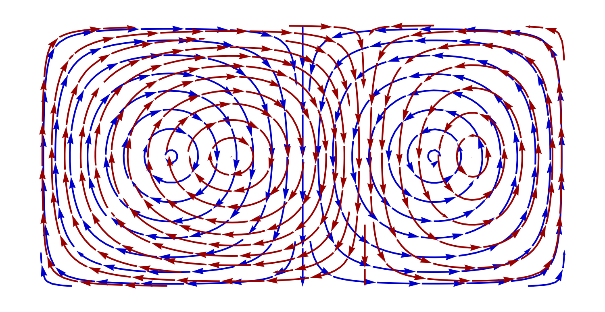
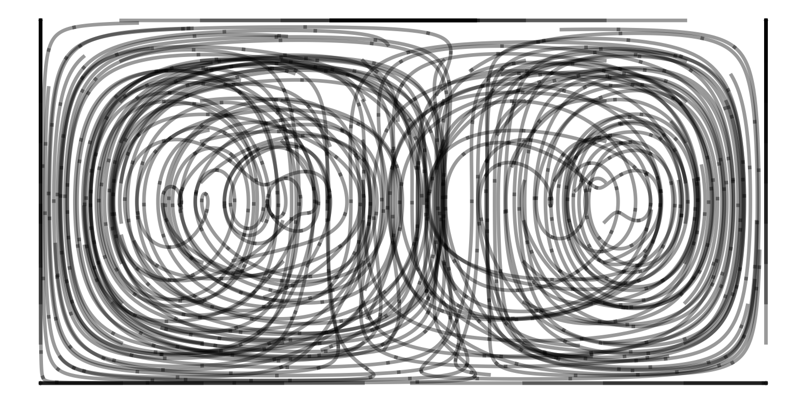
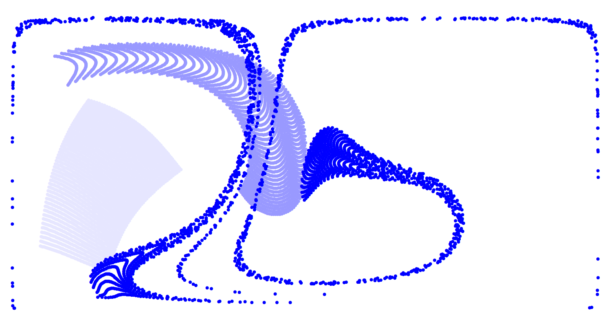
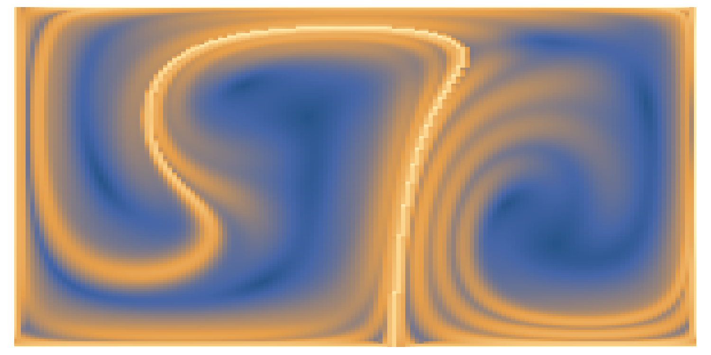
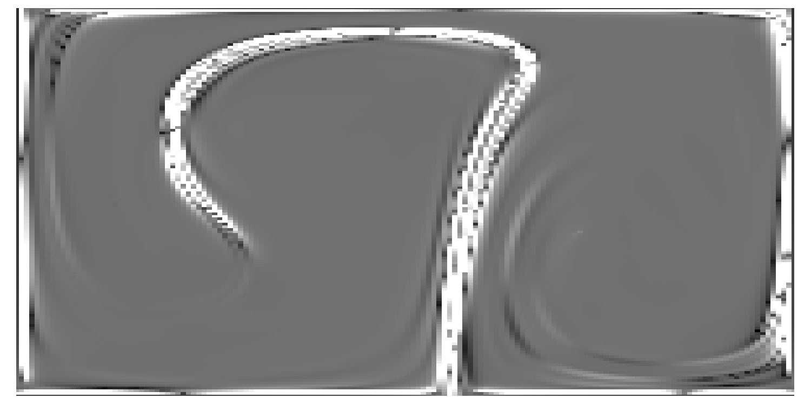

# Lagrange2D

A Mathematica package for the Lagrangian analysis of fluid flows

Example "Double Gyre" Flow Field      |  Pathlines for particles in flow
:-------------------------:|:-------------------------:
	|	

Transport field     |  Maximum finite-time Lyapunov exponents
:-------------------------:|:-------------------------:
	|	

Kaplan-Yorke Fractal Dimension     |  Flushing time distribution
:-------------------------:|:-------------------------:
	|	

## Installation

Download this repository. In your working notebook, make sure that `lagrange2d.wl` is on the path.
The package can then be imported as follows:

	SetDirectory[NotebookDirectory[]]
	<< lagrange2d.wl

## Functions and usage

Please refer to the notebook `demos.nb` for example problems utilizing the various functions in the package. Briefly, capabilities include: Numerical integration of a "blob" of neighboring points, calculation of finite-time Lyapunov exponents and the spatial field of Kaplan-Yorke dimensions, and animation and plotting tools.

See figures above for examples of output plots.

## Theoretical background

The FTLE function in this package is based on research developed by the Haller lab at ETH Zurich. For theoretical background, please refer to the [review of Lagrangian coherent structures](https://www.annualreviews.org/doi/10.1146/annurev-fluid-010313-141322). For a MATLAB package that finds Lagrangian coherent structures using FTLE, please refer to [LCSTool](https://github.com/LCSETH/LCStool)

## Files included in this repository

'lagrange2d.wl' the main package file
`demos.nb` a notebook containing executable examples and outputs
`/resources` contains example output images
`/dev` contains temporary versions used for development
`README.md` contains documentation
`.gitignore` version control auxiliary file
